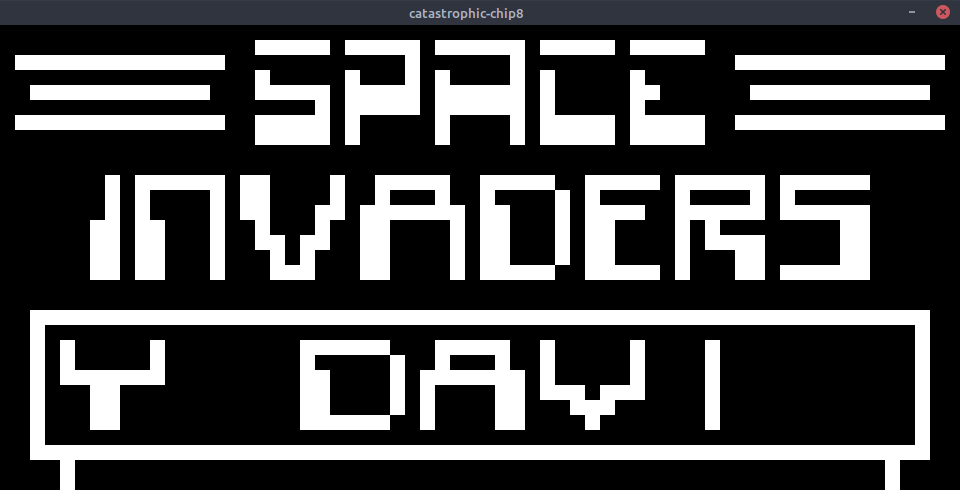
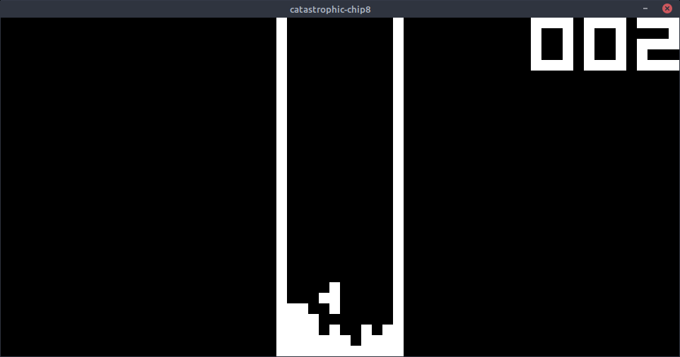

# catastrophic-chip8

A catastrophic [Chip-8](https://en.wikipedia.org/wiki/CHIP-8) emulator written in C to learn about CPU emulation.
It is catastrophic in that my source code documentation is bad, there are several memory leaks with SDL2 that I am unable to fix, 
and my general code style is terrible. Also, it is extremely CPU heavy due to the way CPU cycles are timed. This might be fixed later.

Currently it has these features:
* Runs most Chip-8 games flawlessly (Not Chip-48: support will eventually be added).
* Command-line program interface where a variety of emulation settings can be changed (see [CLI](#CLI) for more info)
* Sound implemented, but as a sine wave instead of the original chip8 square wave.
* Some debug utilities in verbose mode such as vm reloading and CPU dumping.

## How to run
Building this project requires CMake and SDL2, bot of which can be installed with a package manager of your choice. 
More detailed build instructions may be added later to this readme, though, the build process isn't really complex.

## Roms
Roms are located in the "roms" directory. The original chip-8 machine runs at around 500 to 700 Hz, however, some games 
require higher frequencies, as they do not make good use of the timer registers provided. Hence, the clock frequency can be specified 
as a command-line argument (see [CLI](#CLI) for more info).

## Keyboard

Input on the original chip8 machine was done with a hex keyboard. This emulator replicates the keypad through this key-mapping:

| Original | Emulator |
|----------|----------|
| 1 2 3 C  | 1 2 3 4  |
| 4 5 6 D  | Q W E R  |
| 7 8 9 E  | A S D F  |
| A 0 B F  | Z X C V  |

## CLI 

<pre>
catastrophic-chip8 [-hv] [--version] &lt;file&gt; [--cpufreq=&lt;int&gt;] [--vidscale=&lt;int&gt; [--audiofreq=&lt;int&gt;] [--ampl=&lt;int&gt;] [--original]
 Options and arguments: 

  -h, --help           display this help and exit 
  --version            display version info and exit 
  &lt;file&gt;               rom to be loaded 
  --cpufreq=&lt;int&gt;      clock frequency of emulator in Hz (defaults to 700) 
  --vidscale=&lt;int&gt;     video scale (defaults to 10) 
  --audiofreq=&lt;int&gt;    frequency of single chip8 sound in Hz (defaults to 440) 
  --ampl=&lt;int&gt;         amplitude of single chip8 sound (defaults to 20000) 
  -v, --verbose        verbose mode of emulator 
  --original           emulate with orignal instruction set
</pre>

## Screenshots
**Invaders**

**Tetris**

